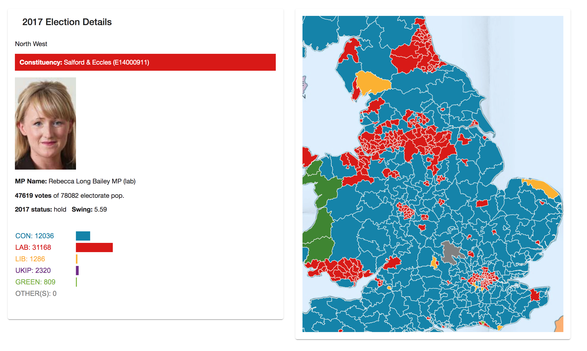
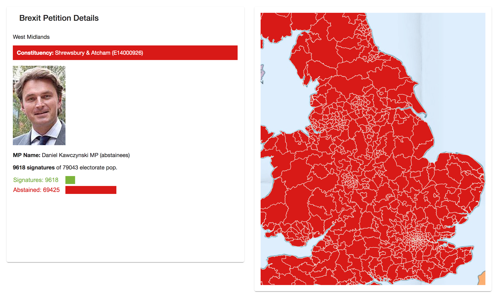
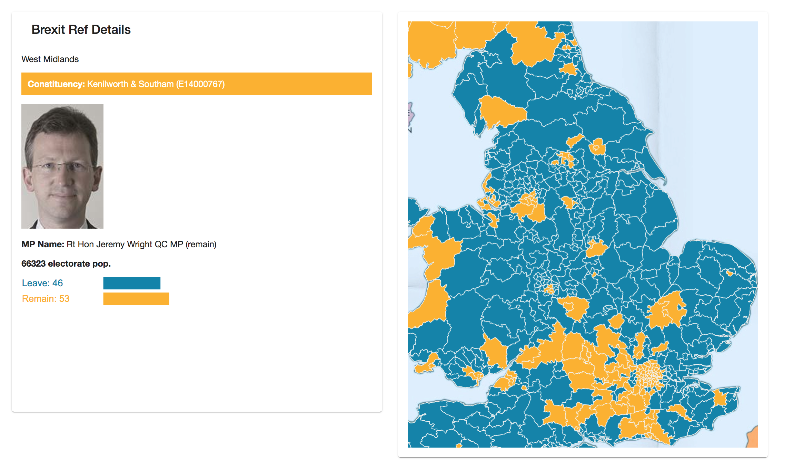

# Election/Brexit Data Visualisation: OpenLayers GIS, d3 Graph

GIS project written in TypeScript and with Angular 8 framework. Without political intent, render of OpenLayers map of the UK, each constituency colour-coded by victor, and d3 bar chart of votes. Neutrally displayed data: results of elections (2017 and 2019), referendum (Brexit), and petitions (Brexit). Hover shows local MP.

## Refactored OpenLayers and d3 code

Both the OpenLayers and d3 libraries were developed for use with JavaScript. Particularly d3's documentation (and any tutorials online) have code that references the DOM by selecting an id tag. However, in Angular, the approach is for the component logic (the .ts file) to update an array which we can loop through with NgFor in the HTML file. Therefore, I developed a new approach to these libraries, where the d3 bar chart is not rendered by injecting items to the DOM, but rather ngFor over 'rect' elements. Thus, I have written my own code to calculate the bar widths, so these are stored in the array.

## Routes

### /ref/brexit
  

Government data is by local authority, which gives no idea of how an MP's area voted - here I present data regrouped by Parliamentary constituency.

### /petition/brexit
  

### /election/[year] e.g. 2017
  

This project was generated with [Angular CLI](https://github.com/angular/angular-cli) version 8.1.1.

## Development server

Run `ng serve` for a dev server. Navigate to `http://localhost:4200/`. The app will automatically reload if you change any of the source files.

## Code scaffolding

Run `ng generate component component-name` to generate a new component. You can also use `ng generate directive|pipe|service|class|guard|interface|enum|module`.

## Build

Run `ng build` to build the project. The build artifacts will be stored in the `dist/` directory. Use the `--prod` flag for a production build.

## Running unit tests

Run `ng test` to execute the unit tests via [Karma](https://karma-runner.github.io).

## Running end-to-end tests

Run `ng e2e` to execute the end-to-end tests via [Protractor](http://www.protractortest.org/).

## Further help

To get more help on the Angular CLI use `ng help` or go check out the [Angular CLI README](https://github.com/angular/angular-cli/blob/master/README.md).
